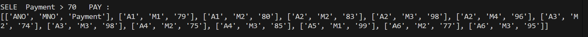
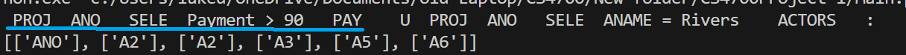

# CS4700 Project 1
Jinho Nam and Luke Davidson

## How to run the program
- Clone this repository
- Write any queries in RAQueries.txt
- Run `Main.py`

## Implemented Operators/Queries
    * SELECT
       - This will call 
    * PROJECT
    * INTERSECT
    * JOIN
    * NATURAL JOIN
    * UNION
    * DIFFERENCE
    * CROSS PRODUCT

## Screenshots 
- Select operator in relational algebra

- Left side of union operator in relational algebra
    (underlined blue line is the left query)

## Output
