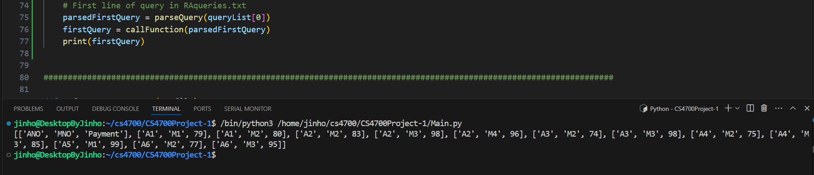
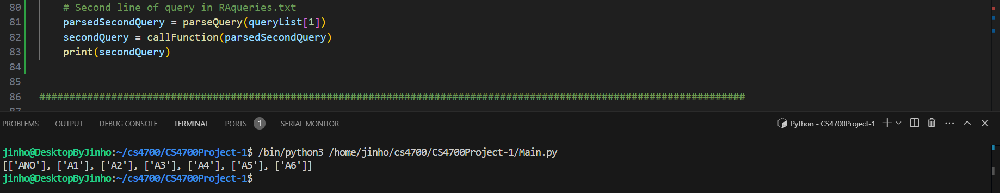
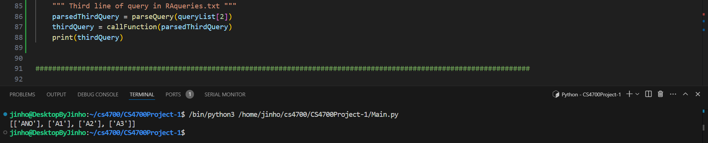
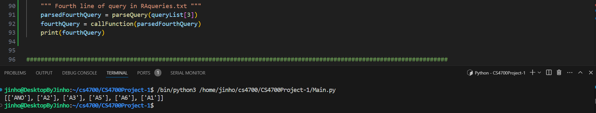

# CS4700 Project 1
Jinho Nam and Luke Davidson


## How to run the program
- Clone this repository
- Write any queries in RAQueries.txt
- Run `Main.py`

## Implemented Operators/Queries
All the queries start by calling `parseQuery()` then `callFunction()`. `callFunction()` is the main part where depending on what is in the query, it calls that function. <br />
* `parseQuery()` <br />
   Takes in an input query and strips all symbols besides any operators that would be important to a query. Returns the query but with spaces instead of symbols. <br />
* `callFunction()`<br />
   Takes in half(or all depending on how long) of a query and looks if it needs to call a SELECT, PROJECT or both. Returns a 2d array with the results

    * `SELECT` <br />
      - parameters(4): `2-D array`, `attribute(column) name`, `binary operator`, `operand`
      - return(1): `2-D array(result relation)`
    * `PROJECT` <br />
      - parameters(2): `2-D array`, `attribute(column) name` 
      - return(1): `2-D array(result relation)`
    * `INTERSECT` <br />
      - parameters(2): `2-D array(relation1)`, `2-D array(relation2)`
      - return(1): `2-D array(result relation)`
    * `JOIN` <br />
      - parameters(5): `2-D array(relation1)`, `2-D array(relation2)`, `attribute1(column) name`, `attribute2(column) name`, `logical operator`
      - return(1): `2-D array(result relation)`
    * `NATURAL JOIN` <br /> 
      - parameters(2): `2-D array(relation1)`, `2-D array(relation2)`
      - return(1): `2-D array(result relation)`
    * `UNION` <br />
      - parameters(2): `2-D array(relation1)`, `2-D array(relation2)`
      - return(1): `2-D array(result relation)`
    * `DIFFERENCE` <br />
      - parameters(2): `2-D array(relation1)`, `2-D array(relation2)`
      - return(1): `2-D array(result relation)`
    * `CROSS PRODUCT` <br />
      - parameters(2): `2-D array(relation1)`, `2-D array(relation2)`
      - return(1): `2-D array(result relation)`

## Screenshots 
1. First line of query in `RAqueries.txt`: <br />
   `SELE_{Payment > 70} (PAY)`
   

2. Second line of query in `RAqueries.txt`: <br />
   `PROJ_{ANO} (ACTORS * PAY)`
   

3. Third line of query in `RAqueries.txt`: <br />
   `(PROJ_{ANO} (SELE_{Payment > 70} (PAY))) - (PROJ_{ANO} (SELE_{Payment < 60} (PAY))) `
   

4. Fourth line of query in `RAqueries.txt`: <br />
   `(PROJ_{ANO} (SELE_{Payment > 90} (PAY))) U (PROJ_{ANO} (SELE_{ANAME = 'L Rivers'} (ACTORS)))`
   

## Output
```
1. SELE_{Payment > 70} (PAY) :

   [['ANO', 'MNO', 'Payment'], 
   ['A1', 'M1', 79], 
   ['A1', 'M2', 80], 
   ['A2', 'M2', 83], 
   ['A2', 'M3', 98], 
   ['A2', 'M4', 96], 
   ['A3', 'M2', 74], 
   ['A3', 'M3', 98], 
   ['A4', 'M2', 75], 
   ['A4', 'M3', 85], 
   ['A5', 'M1', 99], 
   ['A6', 'M2', 77], 
   ['A6', 'M3', 95]]
```
```
2. PROJ_{ANO} (ACTORS * PAY) :

   [['ANO'], 
    ['A1'], 
    ['A2'], 
    ['A3'], 
    ['A4'], 
    ['A5'], 
    ['A6']]
```
```
3. (PROJ_{ANO} (SELE_{Payment > 70} (PAY))) - (PROJ_{ANO} (SELE_{Payment < 60} (PAY))) :
[['ANO'], 
['A1'], 
['A2'], 
['A3']]
```
```
4. (PROJ_{ANO} (SELE_{Payment > 90} (PAY))) U (PROJ_{ANO} (SELE_{ANAME = 'L Rivers'} (ACTORS))):
[['ANO'], 
['A2'], 
['A3'], 
['A5'], 
['A6'], 
['A1']]
```
