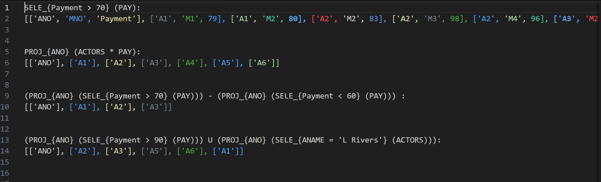

# CS4700 Project 1
Jinho Nam and Luke Davidson


## How to run the program
- Clone this repository
- Write any queries in RAQueries.txt
- Run `Main.py`

## Implemented Operators/Queries
All the queires start by calling parseQuery() then callFunction(). callFunction is the main part where depending on what is in the query, it calls that function.
parseQuery() - Takes in an input query and strips all symbols besides any operators that would be important to a query. Returns the query but with spaces instead of symbols.
callFunction() - Takes in half(or all depending on how long) of a query and looks if it needs to call a SELECT, PROJECT or both. Returns a 2d array with the results

* SELECT -
  * Line Number 235
* PROJECT -
  * Line Number 290
* INTERSECT -
  * Line Number 325
* JOIN -
  * Line Number 358
* NATURAL JOIN -
  * Line Number 404
* UNION -
  * Line Number 473
* DIFFERENCE -
  * Line Number 502
* CROSS PRODUCT -
  * Line Number 525


## Screenshots 
- All 4 example queries working output to RAoutput.csv


## Output
```
SELE_{Payment > 70} (PAY):
[['ANO', 'MNO', 'Payment'], ['A1', 'M1', 79], ['A1', 'M2', 80], ['A2', 'M2', 83], ['A2', 'M3', 98], ['A2', 'M4', 96], ['A3', 'M2', 74], ['A3', 'M3', 98], ['A4', 'M2', 75], ['A4', 'M3', 85], ['A5', 'M1', 99], ['A6', 'M2', 77], ['A6', 'M3', 95]]


PROJ_{ANO} (ACTORS * PAY):
[['ANO'], ['A1'], ['A2'], ['A3'], ['A4'], ['A5'], ['A6']]


(PROJ_{ANO} (SELE_{Payment > 70} (PAY))) - (PROJ_{ANO} (SELE_{Payment < 60} (PAY))) :
[['ANO'], ['A1'], ['A2'], ['A3']]


(PROJ_{ANO} (SELE_{Payment > 90} (PAY))) U (PROJ_{ANO} (SELE_{ANAME = 'L Rivers'} (ACTORS))):
[['ANO'], ['A2'], ['A3'], ['A5'], ['A6'], ['A1']]
```
